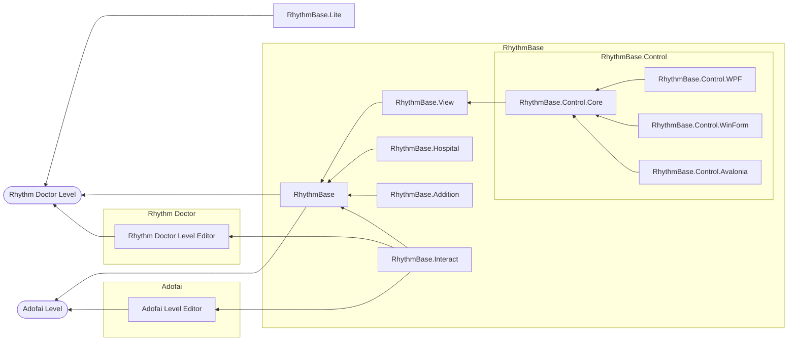

<p align="center">
	<a href="https://www.nuget.org/packages/RhythmBase.View/"></a>
	
</p>

# RhythmBase.View

This library renders Rhythm Doctor events with [SkiaSharp](https://github.com/mono/SkiaSharp).  
See the [example](#example) below for a quick usage sketch.

| Project             | Description                                         | Status           | Link                                                                       | 
|---------------------|-----------------------------------------------------|------------------|----------------------------------------------------------------------------|
| RhythmBase          | Core library for level editing.                     | WIP              | [Go There](https://github.com/RDCN-Community-Developers/RhythmToolkit)                      |
| RhythmBase.View     | Draw all Rhythm Doctor event elements in SkiaSharp. | WIP              | **You are here**                                                           |
| RhythmBase.Addition | Extensions for levels.                              | *Not disclosed*  | -                                                                          |
| RhythmBase.Interact | Interact with Level editor.                         | *Not disclosed*  | -                                                                          |
| RhythmBase.Hospital | Judgement logic for levels.                         | *Not disclosed*  | -                                                                          |
| RhythmBase.Lite     | Lightweight version of RhythmBase.                  | WIP              | [Go there](https://github.com/RDCN-Community-Developers/RhythmToolkitLite) |
| RhythmBase.Control  | Custom controls.                                    | *Not disclosed*  | -                                                                          |



# Example

```cs
int height = 28 * 60;

string file = @"your\level.rdlevel";

using RDLevel level = RDLevel.FromFile(file);
int width = (int)(level.Length.BeatOnly * 28);
Console.WriteLine(level.Length.TimeSpan);

using SKBitmap bitmap = new(width, height);
using SKCanvas canvas = new(bitmap);

foreach (var e in level)
{
	canvas.DrawEventIcon(e, ToLocation(e),   // Provided by this library.
		false,                               // The event is not selected.
		2                                    // The scale of the event.
	);                                       // Returns the hit area used for selection.
}

static SKPointI ToLocation(IBaseEvent e)
{
	return new SKPointI(
		(int)(e.Beat.BeatOnly * 28),
		(e.Y) * 28);
}

using Stream stream = File.OpenWrite("output.png");
bitmap.Encode(SKEncodedImageFormat.Png, 100).SaveTo(stream);

```